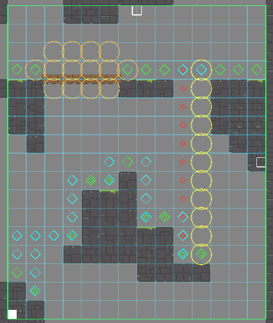

Pathfinding
+++++++++++

**Pathfinding** and **PathfindingBasic** are a-star algorithms that come included with the AI system.
They allow AI agents to follow generated paths towards a target. The main difference between both classes 
is that Pathfinding takes gravity into consideration, so it's ideal for AI agents that need to 
jump from platform to platform. It has many other advanced features, too. The AI agent can be made to climb ladders, walls, 
ceilings, and can walk on bridges. PathfindingBasic ignores gravity and is meant 
for general use in a 2D world. Both systems can be found in the Territory tab for both AITree and AIFSM.

Once a pathfinding territory is created, a green rectangular gizmo will appear in the Scene. Drag and resize this 
rectangle over gameobjects that contain Collider2Ds and the correct layer (usually World).
This will become the area where paths are generated.

.. list-table::
   :widths: 25 100
   :header-rows: 1

   * - Pathfinding
     - 

   * - Data Name
     - The name of the pathfinding territory.
 
   * - Layer World
     - Raycasts will be used against this layer to create the pathfinding terrain. If this is not set, nothing will work.

   * - Max Jump Height
     - The maximum height the AI agent can jump to a platform in the y-direction.
  
   * - Max Jump Distance
     - The maximum distance the AI agent can jump to a platform in the x-direction.

   * - Cell Size
     - The size of each cell in the grid.

   * - Show Paths
     - If enabled, the relevant path nodes and grid will be visible.

   * - Add Ladders, Walls, Ceilings, Bridge 
     - When this is enabled, go to the grid and click on a cell where you wish to add this feature. To remove, simply click on the cell again.
       Walls and Ladders must be created with vertical lines. Ceilings and Bridge must be created with horizontal lines. Bridges need extra circles 
       to ensure the AI agent doesn't sag below due to the bridge. When complete, disable this toggle, and then press the Create Paths button to include the new changes.

   * - Create Paths
     - When pressed, this will create the necessary path nodes. Every time you make a change to these settings, you must repress this button.

When the create button is pressed, the relevant path nodes will appear. The green diamonds represent ground. This is where the AI can walk.
The blue diamonds represent jumping connections. If two platforms are not connected by blue diamonds, the AI cannot jump between the platforms.
The red small diamonds are always vertical and they represent paths where the AI can fall from. These paths are too high for the AI to 
jump to, but they are still available for the AI to fall from. The yellow circles represent a ladder (not depicted). The orange 
circles represent a bridge. The other features will include their own distinct colors.

.. warning:: 
    If using a Tilemap with a Composite Collider 2D, creating the paths will not work since these colliders can't detect raycasts from the inside.
    For a quick fix, change the Geometry Type to Polygons, press the create paths buttons, then revert back to the original Geometry Type if desired.

   
|

Here we can see an AI agent (red square) follow a path to reach the player. The red circles represent the path the AI agent is following.

.. image:: ../images/Pathfinding.*
   :align: center
   
|

Once a pathfinding class is created, leave it alone on its own gameobject and don't add anymore nodes or states. Its only job 
is to generate paths. This will be useful in case there are multiple AI agents referencing the same pathfinding class. To create an AI agent 
that will follow a generated path, create another gameobject and add an AI system. Create two targets. One target 
will be the end point of the path, usually the player. The other target is **Target Pathfinding**. This target will hold a reference to 
the pathfinding class, specify follow speeds, and will request for paths to be generated. 

.. list-table::
   :widths: 25 100
   :header-rows: 1

   * - Target Pathfinding
     - 

   * - Data Name
     - The name of the pathfinder.
 
   * - Map
     - The reference to the pathfinding class.

   * - Speeds
     - The relevant speeds the AI agent will use along the path.
  
   * - Ignore Units
     - If disabled, the AI agents will *try* to block each other along the same path in certain situations. This is to prevent AI agents from overlapping. Other ways to prevent overlapping
       is to give each AI agent a slightly different speed.

   * - Pause After Jump
     - Every time the AI agent performs a jump, it will pause after by the specified amount before continuing to move along the path. This allows the agent's movement to 
       feel a bit more natural.

The last step is to create the **Pathfinder** node. This will be created inside a state if using AIFSM or as a tree node if using AITree.

.. list-table::
   :widths: 25 100
   :header-rows: 1

   * - Pathfinder
     - 

   * - Pathfinding
     - The reference to Target Pathfinding.
 
   * - Target
     - The reference to the target the AI agent is trying to follow.

   * - Reset Distance
     - When the target changes its position by this amount, the system will generate a new path for the AI agent to follow.
  
   * - Success On
     - If enabled, this node will return Success if the condition has succeeded.

.. note:: 
     The steps to setup **PathfindingBasic** will be similar but with less settings due to its simplistic nature.
