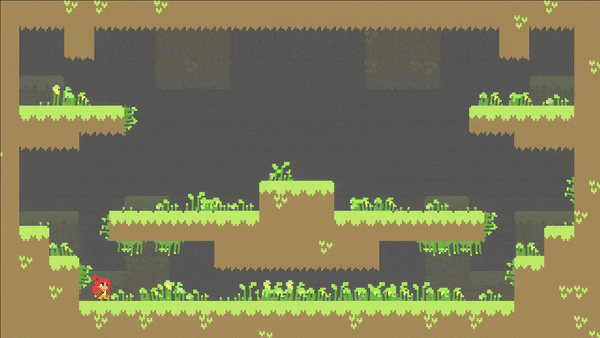

Foliage
+++++++
.. complete!
Decorate an environment with foliage to make it come alive. The foliage can sway with the wind and respond
to all characters. Add this component to an empty gameobject.

   
|

.. list-table::
   :widths: 25 100
   :header-rows: 1

   * - Property
     - 

   * - Jiggle
     - The motion effect produced when interacting with characters. Smaller values produce softer motions.

   * - Damping
     - How quickly the jiggle effect dissipates.

   * - Uniformity       
     - The tendency for foliage to sway in the same direction if the foliage has the same y position.
      
   * - Wind Strength       
     - The force of the wind swaying the foliage.

   * - Wind Frequency
     - How quickly the wind changes direction.

   * - Create Texture
     - Press this button to add a new Texture2D. This is the foliage. Each Texture2D must have the same size as the specified Vector2 field.

.. warning:: 
   The system groups all the Texture2D images of the foliage into an array. Thus, every Texture2D must be of the same size and share the same settings for
   this process to work correctly. As a reminder, this component is working with Texture2D and not Sprites.

.. list-table::
   :widths: 25 100
   :header-rows: 1

   * - Texture2D
     - 

   * - Texture2D
     - The current Texture2D image of the foliage. The delete button will remove this Texture2D and all of its instances from the scene.

   * - Orientation     
     - This determines what vertices to sway. If Bottom is enabled, place foliage on ground. If Top is enabled, place foliage on a ceiling. If Left or Right are enabled, place foliage on walls.

   * - Depth
     - Specify the rendering order of the Texture2D images relative to each other. As of now, there is no way specify a sorting layer. 
       Characters are either in front or in back of the foliage -- never in between.

   * - Interaction     
     - Choose how active the foliage is with character interactions. Maybe some foliage are dense and don't need to sway as much as others. A value of zero will disable all interactions with characters.
      
.. list-table::
   :widths: 25 100
   :header-rows: 1

   * - Paint Brushes
     - Place foliage in the scene with brushes.

   * - Single Brush
     - Place a single foliage image.

   * - Random Brush
     - Choose as many foliage images as desired and drag the brush in the scene. The density value specifies how many images the brush can place per position.

   * - Eraser    
     - Use this brush to erase foliage images. Please note, some foliage instances will still be visible even after erased. Sometimes it takes Unity time to remove them completely.
     
   * - Instances
     - Every Foliage component can only have a maximum of 1023 images in the scene.

.. tip:: 
   If the brush tool is active, right click in the scene or repress the current brush button to deactivate it.
   
.. note:: 
   The foliage system was designed with performance in mind. All foliage instances exist in code only (they're not gameobjects), and the character interactions
   are handled by Unity's Job System. 