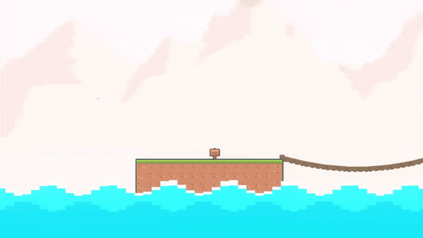

Water
+++++

Water is a dynamic area where the player can float and swim. Add this component to an empty gameobject.

   
|

.. note::
 The player's Swim ability must be enabled to interact with water.

.. list-table::
   :widths: 25 100
   :header-rows: 1

   * - Property
     - 

   * - Shape       
     - If Square is enabled, the system renders the water using square blocks. No textures or sprites are required. However, the sorting layer will always
       be set to default (a Unity limitation). If Round is enabled, the system renders the water using a Mesh Renderer, creating a more curved wave.
       A Texture2D and Material are required. 
 
   * - Type     
     - If Float is enabled, the player will stay above the water line. 
       If Swim is enabled, the player can swim inside the water.

   * - Segments
     - The number of elements that create the water. The higher the number, the less blocky the water will look.

   * - Create On Awake
     - If enabled, the water will recreate itself on Awake in case it was moved. Typically, you want to initialize this during editor time to reduce initializing time.

   * - Texture2D
     - If Shape mode is Round, provide the Texture2D that will be used to render the water.

   * - Material
     - If Shape mode is Round, provide the Material that will be used by the Mesh Renderer.

   * - Amplitude
     - The maximum height of the wave.

   * - Frequency
     - Dictates the number of waves in the water.

   * - Speed
     - How quickly a wave moves across the water.

   * - Spring
     - The force exerted on the water when interacting with the player.

   * - Damping
     - How quickly the spring force dissipates.

   * - Turbulence
     - This adds random noise into the water, creating a chaotic effect.
   
   * - Random Current
     - This will change the direction of the speed at intervals specified by this value. This value is randomized slightly to add unpredictability.
  
   * - Create
     - Once all the settings are chosen, press this button to create the body of water. Anytime you change the water's position or a setting, recreate the water to enact the changes.

.. list-table::
   :widths: 25 100
   :header-rows: 1

   * - Body
     - For Square mode.

   * - Top    
     - The color of the water line.
 
   * - Thickness 
     - The thickness of the water line.

   * - Taper
     - The wave's water line will be thicker at its crest, and thinner at its trough.

   * - Middle 
     - The color at the middle of the water.

   * - Bottom
     - The color at the bottom of the water.

   * - Phase
     - The bottom of the water has wave like motion as well. Specify the phase of this wave.

   * - Offset
     - Offset the position of the bottom wave.

   * - Speed
     - How quickly the bottom wave moves across the water.