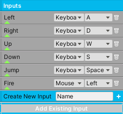
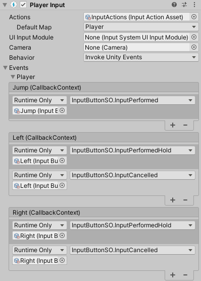
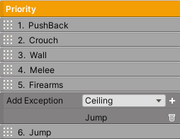

Player
++++++
.. complete!
The player is the centerpiece of your game, and as such, the engine provides plenty out of the box customizable abilities. 
To get started, add a **BoxCollider2D** and a **Player** component. The Player class will handle the input, abilities, and
world collision settings. You will also need to add a **RigidBody2D** to keep Unity happy, and set Body Type to Kinematic.

.. list-table::
   :widths: 25 100
   :header-rows: 1

   * - Method
     - 

   * - BlockInputs(bool value)
     - This will block player input if true.

------------

Inputs
======

The engine implements a basic input system that can handle Keyboard and Mouse input directly (and in the most recent version, it will also interface with the new 
input system). These inputs will be used to move the player and interact with the game world. And because each input is actually a scriptable object (**InputButtonSO**), 
it becomes very easy to read and set input values. So, if you wish to control the player by other means, it's entirely possible 
to control these inputs through method calls. 

It's important to note you can change Keyboard and Mouse input keys during runtime, and the system will automatically 
save these changes using PlayerPrefs.

By default, the system will create common inputs for movement, jumping, and firing. To create an input of your own, 
press Create New Input. Once the input is created, an InputButtonSO is automatically created
and placed in the AssetsFolder/Inputs folder for reference. The input you see in the inspector is directly linked to its
InputButtonSO.

Each input has the ability to **bind** to other inputs. For example, if the jump input is bound to another input,
then each time this other input goes true, the jump input will also go true. To bind inputs simply click the bottom triangle
toggle and start adding them. You will need to set the InputButtonSO reference.

.. important::
   The system expects the Left, Right, and Jump inputs to always exist. They also need to have these exact same names. So don't delete them!

   
|

.. list-table::
   :widths: 25 100
   :header-rows: 1

   * - Inputs
     - 

   * - Name and Type
     - Pick the type of input, Keyboard or Mouse.
 
   * - Button
     - Pick which key will be used by the Keyboard or Mouse.

   * - Bind Inputs
     - The references to the bound inputs.

.. list-table::
   :widths: 25 100
   :header-rows: 1

   * - InputButtonSO
     - Methods

   * - ButtonPressed()
     - This will set input pressed as true.
 
   * - ButtonHold()
     - This will set input hold as true.

   * - ButtonReleased()
     - This will set input released as true and will set input hold as false.

   * - Holding()
     - Returns true if the input is being held.
 
   * - Pressed()
     - Returns true if the input is pressed.

   * - Released()
     - Returns true if the input is released.

   * - OverrideKeyboardKey (KeyCode newKey)
     - Override the keyboard key.

   * - OverrideMouseKey (int newKey)
     - Override the mouse key. 1 == Left. 2 == Right. 3 == Middle.

----------

You will also notice that some player abilities have a setting called Button Trigger. This setting 
allows you to choose when an input becomes active.

* On Hold
* On Press
* On Release
* Always
* Never
* Active

Always and Never are primarily used for AI weapons. Setting it to never will prevent the 
weapon from being fired accidentally by player input, and setting it to always will mean it's
always shooting! Active means the input is being held or pressed.

----------

It's also now possible to interface with the **new input system**. First, install the package through 
the Packet Manager if it's not installed already. By default, Flare Engine uses the old input system and 
if you disable it, you will get an error. So, in Project Settings/Player set Active 
Input Handling to Both. 

Next, add the Player Input component to the Player's gameobject and set the reference 
to an InputActionAsset. Demo1 already has this setup and you can find this asset in the Demo/Assets folder. 
It contains some default values mapped to a generic controller. However, there's still a good chance the 
default settings won't work depending on your controller, in which case you need to open InputActions and 
bind your specific controller inputs. You will need to refer to Unity documentation to get familiar 
with this process.

Next, on the Player Input set Behavior to Invoke Unity Events. Open the events foldout as well as the 
action maps. In this case, it's called the Player. Then connect InputButtonSO to these events and call 
the following methods:

.. list-table::
   :widths: 25 100
   :header-rows: 1

   * - New Input System
     - Methods

   * - InputPerformed()
     - This will set input pressed as true.
 
   * - InputPerformedHold()
     - This will set input hold as true.

   * - InputCancelled()
     - This will set input released as true and will set input hold as false.

   
|

For instance, to get an input to behave like a button press just call InputPerformed() as seen by the Jump Input.
However, if you want the input to behave like a hold, call both InputPerformedHold() and InputCancelled() like 
the movement inputs. In some instances, you might even call all three methods to get the desired effect. After 
you complete this setup, the new input system will now be in charge of calling these methods.

.. important::
   If using the new input system, the system will no longer have the ability to change and save input bindings during runtime.

------------

Priority
========

If the player has more than one ability enabled, you will have to assign their priority. This means that 
if two or more abilities become active at the same time, the ability with the highest priority will execute while the 
other abilities are cancelled. This is to prevent awkward situations. For example, let's say that when the player is
climbing a wall, the player must not have the ability to shoot its firearm or else a shooting animation might commence. 
This will look weird if the shooting animation does not account for the wall holding. With the priority system, this 
can be prevented.

   
|

However, it's sometimes necessary for abilities to coexist. The system implements exceptions for these situations. 
Any ability can add exceptions, which allows the specified abilities to execute concurrently with it. 
For example, when the player shoots a firearm, if the Firearms ability does not include the Jump ability as an exception, 
the player will not be able to fire a projectile and jump at the same time. To remedy this, add the Jump exception 
to the Firearms priority.

To set a priority, simply drag the priority blocks over each another. **Number one is the highest priority**. 

.. tip::
   If using the PushBack ability, it's recommended to set it as the highest priority so when the player is damaged,
   it will disengage from whatever ability it is currently using, like climbing a wall.

------------

Settings
========

.. list-table::
   :widths: 25 100
   :header-rows: 1

   * - Property
     - 

   * - Jump
     - The jump height and jump time dictate the value of gravity.

   * - Rays
     - The number of raycasts that will extend horizontally and vertically from the character to detect the world. Keep this number low for efficiency.

   * - Climb Slopes
     - If enabled, the character will be able to climb slopes no higher than the max slope.

   * - Rotate To Slope
     - If enabled, the character will rotate according to the rotate rate to be perpendicular with the ground.

   * - Rectify In Air
     - If enabled, and if the character is rotated and jumps, it will rotate to a squared position.

   * - Check Corners
     - If enabled, the system will check if platform corners are going into the side of the character and prevent it. Note, if Climb Slopes is enabled, 
       the system will automatically check for corners going through the bottom of the character.

   * - Use High Jump
     - If enabled, the character will be able to use High Jump.

   * - Use Bridges
     - If enabled, the character will be able to walk on bridges.

   * - Use Moving Platforms
     - If enabled, the character will be able to interact with moving platforms.

   * - Collide With World Only
     - The system checks for both World and Platform collisions. Enabling this will only check for World collisions.

   * - Use Late Update
     - For AI only. If enabled, the character will execute during Late Update instead of Update.

   * - Crushed By Platform
     - The Unity Event invoked when the character is crushed between two hard surfaces. This happens when the character is standing on or holding a moving platform and 
       is moved into a hard surface, or when the character is pushed into a hard surface. This event typically means a character death, and the character's position 
       needs to be reset, or else the character will move into a wall and create an ambiguous scenario. Call a World Effect with the dynamic Activate method.

------------

Edge Collider 2D
================

When dealing with platforms that contain **EdgeCollider2D**, the character can jump through a platform if the jump button is being held. Otherwise, the system will interpret 
the platform as a ceiling. The character can jump down through a platform if the down button is being held. Of course, this can only work if the Jump
and Down inputs exist.

------------

Ability
=======

Click the red button to add abilities into the system. Any ability can be paused by calling the Pause method from its component. For convenience, each ability 
can be paused in the inspector during development.

------------

Creating An Ability
===================

Create a unique ability if the engine doesn't already provide it. Follow the template below.

.. code-block:: c#

   using UnityEngine;

   namespace TwoBitMachines.FlareEngine.ThePlayer
   {
       public class Ability : MonoBehaviour
       {
                // None of the methods below are required. Use them as necessary
                public override void Initialize (Player player)
                {
                // Initialize variables here. This is called in Awake.
                }

                public override void Reset (AbilityManager player)
                {
                //  Reset important variables here. 
                }

                public override bool TurnOffAbility (AbilityManager player)
                {
                //  This is called when a higher priority ability overrides this one.
                //  Reset important variables. Usually the Reset method is called here.
                //  Return false if this ability is doing an important task that can't be cancelled.
                //  For example, the crouch ability can't be cancelled unless the player has enough
                //  head room to fully stand up. Return true if it can be cancelled.
                        return true;
                }

                public override bool IsAbilityRequired (AbilityManager player, ref Vector2 velocity)
                {
                //  This is where the system checks if the ability has become active. Some condition
                //  will go true, usually a button is pressed, in which case return true.
                        return false;
                }

                public override void ExecuteAbility (AbilityManager player, ref Vector2 velocity)
                {
                //  Place the code that executes the ability here. This is only called if the ability
                //  is active.
                }

                public override void EarlyExecute (AbilityManager player, ref Vector2 velocity)
                {
                //  This is always called before ExecuteAbility. Sometimes it's necessary to execute 
                //  code before anything else. The ability itself shouldn't execute here. However,
                //  if the ability is simple enough and always needs to run, execute the ability here. 
                //  The Ground ability functions this way. If doing this, just make sure the ability
                //  won't interfere with any other abilities.
                }

                public override void LateExecute (AbilityManager player, ref Vector2 velocity)
                {
                //  This is always called after ExecuteAbility. Firearm ability uses it to apply 
                //  recoil to the player.
                }

                public override void PostCollisionExecute (AbilityManager player, Vector2 velocity)
                {
                //  This is called after all the abilities and collision checks have executed.
                //  This velocity was the total velocity applied to the player during the frame.
                }
       }
   }

   // The AbilityManager has many variables to be aware of.

   // player.signals    -- set relevant signals: player.signals.Set ("signalName")
   // player.world      -- read if player is onGround, onSlope, onMovingPlatform, etc
   // player.inputs     -- read button inputs: player.inputs.Pressed("buttonName"), etc
   // player.gravity    -- the value of gravity
   // player.maxJumpVel -- the maximum jump force
   // player.onSurface  -- set true if the player should be standing on a surface. Bridge uses this
   // player.jumpButton -- read if the jump buttons have been pressed
   // player.hasJumped  -- set true if the ability made the player jump
   // player.checkForAirJumps -- set true if the ability made the player jump
   // player.playerDirection -- the direction of the player in the x-direction
