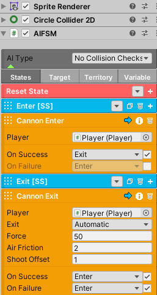

Cannon
++++++

The player can jump into certain objects, such as barrels, and blast off in 
the direction of the object. This ability can only work with the use of the 
Cannon Enter and Cannon Exit AI Nodes.

By using AIFSM, you gain a high degree of flexibility and customization. AIFSM 
allows for additional states to control the cannon's behavior. This includes
rotating and moving the cannon in different paths to create obstacles.
For more interesting examples, please refer to the demo.

In their most basic setup, the cannon nodes consist of a couple of 
states to execute. The cannon AI will require a Collider2D 
component that is set to IsTrigger mode to detect the player.

   
|

.. important::
   The player can't take damage inside a cannon.

.. list-table::
   :widths: 25 100
   :header-rows: 1

   * - Cannon Enter
     - 

   * - Player
     - Set a reference to the player for detection.

.. list-table::
   :widths: 25 100
   :header-rows: 1

   * - Cannon Exit
     - 

   * - Player
     - Set a reference to the player.

   * - Exit
     - If Automatic is set, the player will exit the cannon immediately. If Button is set, 
       the player will exit the cannon once the specified button is pressed.

   * - Force
     - The force of the cannon blast.

   * - Air Friction
     - The friction applied to the force over time.

   * - Blast Offset
     - This offset is applied to the player's position when they initially exits the cannon.

**Signals: cannonBlast**