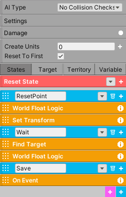

Check-Point
+++++++++++

On a game reset, the system will reset the player's position at the desired location, saving player progress.
There are two versions of this system. The first one is a streamlined version, and the second was constructed using the AI system. 
Both work, but the first one is recommended as it is a more intuitive approach.

Streamlined version
===================

Add the **Check Point** component to an empty gameobject. You will then add check-point triggers to your level by clicking 
the add button and dragging the triggers in the scene. The player will be reset at the bottom center of the trigger.

.. list-table::
   :widths: 25 100
   :header-rows: 1

   * - Property
     - 

   * - Name
     - This must be a unique name for every scene.

   * - Type
     - Priority: if the check-point's index is greater than the current saved value, the system will save the new check-point.
       Any: the system will accept any check-point as the new check-point regardless of index.

   * - Button
     - If the check-point is set to On Button Press, the button that must be pressed to save to this current check-point.

   * - On Reset
     - The Unity Event invoked when the player has been reset.

   * - On Save
     - The Unity Event invoked when a check-point has been saved.

.. list-table::
   :widths: 25 100
   :header-rows: 1

   * - Check Point
     - 

   * - Index
     - The priority index of the check-point. The larger the number, the higher the priority.

   * - Position
     - The position of the check-point in the game world. This is the position the player will reset to.

   * - Save
     - If Automatic, the new check-point will be saved immediately. If On Button Press, the button that must be pressed 
       to save. If Save Manually, the method SaveManually must be called to save. All these options require the player 
       to be inside the check-point.

   * - On Reset
     - The Unity Event invoked when the player has been reset.

   * - On Save
     - The Unity Event invoked when a check-point has been saved.

AI FSM version
==============

The AI version can serve as a good case study and give you an idea on how to create your own systems. 

   
|

------------

This system uses a AIFSM, for keeping track of the player, and a World Float, for saving the state of the check-point system. 

Before explaining the states, first let's see how the system is designed. Each level can have as many check-points as desired. 
For this particular scenario there are three check-points. Each check-point will be placed in the game world and each one will 
have a corresponding arbitrary index. So 1, 2, and 3. 

Once the player goes inside a check-point area, the FSM will save its index 
in the World Float (which will have Save enabled). If the current value of the World Float is less than the check-point index, the value will 
be updated. This means the check-point system works in terms of priority. If the player goes back inside check-point 1 but has already been 
to check-point 2, the system will not revert back to check-point 1. And on a game reset, the AIFSM will move the player to the 
desired location of the check-point that matches the saved value with its index.

------------

How are the check-points aware of each other? 
=============================================

World Float is the glue that holds everything together. Each check-point comes with a World Float, and each World Float 
must have exactly the same name as all the others. If each World Float has the same name, it means they are saving 
to the same variable in memory, so they all reference the same data. And equally important, each time a World Float is modified it will send 
a signal to each World Float that shares the same name and it will update their values to match. For this broadcast signal to work, 
the Broadcast Value must be enabled for each World Float. This will ensure all the World Floats are working with the same value.

------------

How does the Check-Point FSM work?
==================================

The FSM has three states. The first state, ResetPoint, will check if the World Float matches its index. If it does, the state will 
reset the player's position using Set Transform. Since this is the first state, the AI system will always check this state first 
on scene start. On a game reset, enable Reset To First in settings, which means the AI system will move back to the first state 
on a game reset and reset the player's position.

Regardless of what happens in ResetPoint state, the system will move to the wait state. Here, the system will wait until the player 
enters its territory using Find Target. If the player does enter its territory, it will compare the World Float current value with its index. 
If the World Float current value is less than the current index, the system will move into the Save state and save the index into the World Float 
and then revert back to the Wait state. 

It's important to note the Wait state is set to Sequence Succeeded, which means the state will not 
check World Float Logic until Find Target has returned success.

.. important::
    The parts you must modify: in Set Transform, input the reset position. In each World Float Logic and On Event, place the index of the check-point.
    You will also need to move each territory (green rectangle) manually in the scene for each check-point.
