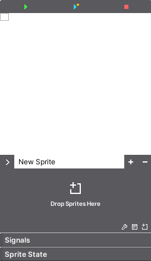
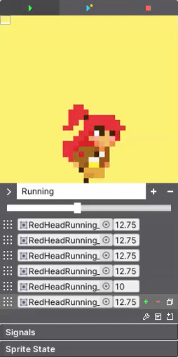
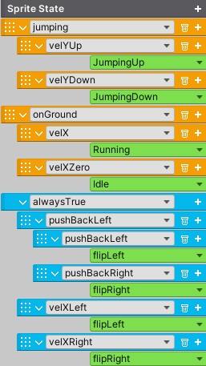
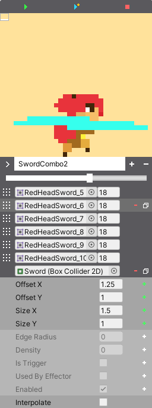

Sprite Engine
+++++++++++++

The **SpriteEngine** component provides an extremely easy way for creating and storing sprites. 
The Sprite Engine removes the hassle of working with different systems and centralizes 
the power of creating sprites all in one place. Hence, there is no more need for creating 
animation objects or jumping from window to inspector to set things up. Everything is handled
in the inspector. This system will even handle the logic for controlling the animation state 
of your character, **so there is no need to code**. The system really does aim to be a one stop 
solution for sprite animations.

To get started, simply add the SpriteEngine component to any gameobject. A SpriteRenderer will be 
added automatically. You will then see this.

   
|

.. list-table::
   :widths: 25 100
   :header-rows: 1

   * - Property
     - 

   * - Play Buttons
     - Play the sprite in the inspector or in the scene.
 
   * - Display Window
     - Displays the sprite. Drag and zoom the window. Right click to reset the window. Change the background color in the upper left corner.
 
   * - New Sprite
     - Create, name, and remove sprites. Use the drop down menu to change between them. By default, the system creates one sprite called New Sprite. Rename it.

   * - Drop Sprites Here
     - When a new sprite is created, drop the sprites here. Click this area to lock the inspector for convenience.
  
   * - Wrench Icon
     - Add properties to each sprite to modify, like a Transform or Collider2D.

   * - Options Icon
     - Extra animation options.

   * - Drop Icon
     - Replace all the current sprites.

   * - Sprite Swap Icon
     - Set the reference for a Sprite Swap scriptable object.

   * - Signals
     - Signals are used to control the animation state.

   * - Sprite State
     - Create an animation state machine.

Once a sprite has been created, the sprite menu will appear. Rearrange, add, and delete sprites here. 
You can also test the play rate by adjusting the global speed slider. This will set the speed for all the 
sprites instantly. For customization, each sprite can also be applied an individual play speed. 

   
|

Extra animation Options.

.. list-table::
   :widths: 25 100
   :header-rows: 1

   * - Property
     - 

   * - Synchronize
     - This can synchronize two animations. For example, if you have an idle 
       shoot animation and then the player starts to run, the run shoot animation will synchronize
       to complete the shooting animation. To use this, enable and ensure that both 
       animations have the same Sync ID int value. The Sync ID should not be zero.
 
   * - Loop Once
     - This will cause the animation to only loop once.

   * - Loop Start Index
     - This specifies the index from which the sprite should start playing after it has already been played once.

   * - Loop Once Event
     - If loop once is enabled, this Unity Event will be invoked once the animation has completed its loop.
   
Sprite Swap
===========

To create different player skins, use the Sprite Swap scriptable object by right-clicking and 
selecting Create/FlareEngine/SpriteSwap. Open the object and add the necessary skins. Each 
skin will require animations that you will also need to add such as Idle, Run, etc. 
Make sure these animation names match across all skins, including the default animations 
in Sprite Engine. Also, each animation should have the same number 
of frames as all its counterparts.

You will need to add Sprite Swap as a reference to Sprite Engine. During runtime, 
to switch to a new skin, call the Swap method on the Sprite Swap scriptable object (or 
Sprite Engine) and specify the name of the skin you wish to switch to.

For more details, check out the SpriteSwapping demo scene to see how Sprite Swap is 
set up to switch between skins.

Signals
=======

Signals are simple booleans that play an essential role in the animation state machine. 
When a signal is set to true, the state machine reads it and plays the corresponding sprite. 
For instance, when a character touches the ground, the onGround signal is set to true. 
The Sprite Engine then reads this signal and plays the standing animation.

The Sprite Engine has the potential of setting multiple signals, and for convenience, 
all possible signals that the engine can set are automatically provided. To use them, 
you only need to enable the signal block by clicking on it. However, if you're not using 
Flare Engine, you will need to provide these signals to the Sprite Engine by setting them 
to true. To do this, you will require a reference to Sprite Engine (using TwoBitMachines.TwoBitSprite), 
and set tree.signal, which is a Dictionary<string, bool>. The string represents the name of the signal, 
and the boolean indicates its active state. If you're using Flare Engine, you don't need to worry 
about this since the engine will read and reset the signals.

Additionally, you can create your signals by using the Create Signal field. 
These signals are mostly necessary for creating attack animation signals.

State
=====

The state machine configures the animation state of a character by reading signals 
and setting the appropriate animations.

Once all the signals and sprites have been created, click the add button to create a state. 
The animation state (depicted in orange) will have a list of all the available signals. Once the signal
is chosen, choose the animation (depicted in green) that should play if the signal goes true.

**States must be arranged in priority order from top to bottom. The system will run until it finds 
the first successful signal and then exit.**

Each state can also have a sub-state in case there is a group of related signals that need 
to be organized. Sub-states can be nested up to four levels.

The example below shows a state machine with two states. The jumping state has two sub-states. If the jumping
signal goes true, the system will check the signal velYUp, which means the velocity is positive. If it's true,
the system will play the JumpingUp sprite. If VelYDown is true instead, the system will play the JumpingDown sprite.

You will also notice the blue state, which is responsible for flipping the sprite 
int the x or y direction. The top signal is set to alwaysTrue so that the system is always checking this state. 
The most common signals to check will be velXLeft and velXRight. If the x velocity is pointing in
either of those directions, the system will flip the sprite in that direction.

   
|

.. important::
 All your sprites must be created facing to the right to work correctly with sprite flip.

Transition
==========

Animations can transition from one to another, allowing for smooth movement between states. For instance,
when transitioning from the idle animation to the crouching animation, a "crouching down" animation 
can be used to create a seamless transition.

To continue this example, we can create a transition for the crouch animation. Set the Condition 
to the onGround signal, as we want to transition from idle to crouch. The From animation is the starting animation, 
which is idle. The To animation is the transition animation, which should be the crouching down animation. 

It's important to note that all transition animations should exist in Sprite Engine and only belong in the 
transition section, not the state machine.

Properties
==========

This allows every sprite to have extra properties to modify and a per frame basis. Sometimes it's necessary to
control a Transform or a Collider2D to work seamlessly with the animation. A very common scenario is to 
modify a Collider2D and change the size of its collision area to work with an attack animation.

Click the wrench icon and then select the type of property to work with. Once selected, the property will appear 
in the sprite menu. Set its reference and open it to begin modifying.

   
|

.. tip::
 When working with properties, you can see the changes made to them in the scene.

In the example above, the animation depicts a sword attack. On the second frame, we can see the BoxCollider2D has 
its offset and size set to particular values. If the third frame is selected, the values for these settings can 
be the same or different, depending on what's necessary for the animation. The properties must be enabled by clicking 
the green plus button. You can also choose to interpolate these properties from frame to frame by enabling the 
interpolate toggle. Once enabled, the I button will appear next to each plus button. Click on it to enable interpolation 
for the specified property.

.. tip::
 It is common for attack animations to loop only once. The OnLoopOnce event usually
 calls some method to let the system know the animation is complete.