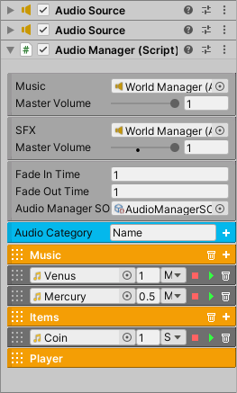

Audio Manager
+++++++++++++
.. complete! Done
The **AudioManager** conveniently stores all the music and sound effects for the current scene.
It requires two audio sources that must be added manually. One will be dedicated to playing music, and 
the other will be dedicated to playing sound effects.

   
|

The Audio Manager component and the audio sources can be added to the World Manager's gameobject.
In the inspector, go to Audio Category, specify a category name, and click the add button. This will create an
audio category, which is meant to organize sounds into groups for convenience. Each category 
has an add button to create a sound item. In each sound item you can specify the audio clip, volume, type, and
can even play the audio clip in the inspector. 

To play an audio sound call the provided methods. Since the engine contains plenty of Unity Events, it's possible 
to play audio from almost any system. And as such, **AudioManagerSO** is a scriptable object that can be created to 
hold a reference to Audio Manager, which means you can drag and drop Audio Manager SO into any Unity Event instead. This will 
allow you to play audio in the same way while using the flexibility of a scriptable object. To create one right click
Create/FlareEngine/AudioManagerSO.

.. list-table::
   :widths: 25 100
   :header-rows: 1

   * - Property
     - 

   * - Music
     - The reference to the audio source that will play music.

   * - Music Master Volume
     - This will scale the sound level of each music item. A value of zero means there's no music sound.

   * - SFX
     - The reference to the audio source that will play sound effects.

   * - SFX Master Volume
     - This will scale the sound level of each sfx item. A value of zero means there's no sfx sounds.

   * - Fade In Time
     - The amount of time to fade in music.

   * - Fade Out Time
     - The amount of time to fade out music.

   * - Audio Manager SO
     - The scriptable object reference for playing audio.

   * - Audio Category
     - Create an audio category with the specified name.

.. list-table::
   :widths: 25 100
   :header-rows: 1

   * - Method
     - 
 
   * - PlayAudio (string audioName)
     - Play this audio. This can be a music or sfx item.

   * - FadeInMusic (string musicName)
     - This will gradually fade in the music sound instead of playing it at its maximum level immediately.

   * - FadeOutMusic ( )
     - This will gradually fade out the current music playing. 

   * - FadeToNewMusic (string musicName)
     - This will fade out the current music and fade in the new music.

   * - MusicVolume(float value)
     - Change the current sound level for music. Must be a value between 0 and 1f.

   * - MasterMusicVolume (float value)
     - Change the master volume for music. Must be a value between 0 and 1f. This value will be remembered by PlayerPrefs.

   * - SFXVolume(float value)
     - Change the current sound level for sfx. Must be a value between 0 and 1f.

   * - MasterSFXVolume (float value)
     - Change the master volume for sfx. Must be a value between 0 and 1f. This value will be remembered by PlayerPrefs.

   * - StopMusic()
     - Stop playing music.

   * - StopSFX()
     - Stop playing sfx.

   * - PauseAllAudio()
     - Pauses all audio sounds.

   * - UnpauseAllAudio()
     - Unpauses all audio sounds.

   * - StopAllAudio()
     - Stops all audio sounds.