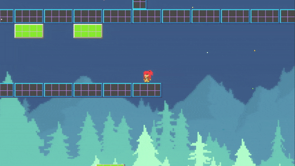
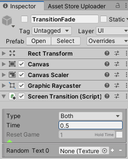
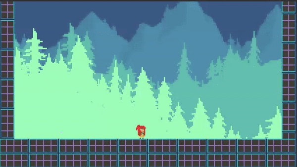

Screen Transition
+++++++++++++++++

Screen Transitions occur at the beginning and end of a scene, or when the current scene is reset. 
You can use these transitions by utilizing the **ManageScenes** and **ScreenTransition** components,
using pre-made prefabs found in AssetsFolder/Transitions/Prefabs. 

At its core, a transition gameobject includes a canvas and an image with a black and white gradient 
texture. A shader then applies the pattern of the transition. On completion, it deactivates.

   
|

.. list-table::
   :widths: 25 100
   :header-rows: 1

   * - Property
     - 

   * - Type
     - If Transition In, the transition will reach maximum coverage. If Transition Out, the transition will reach complete transparency.
       If Both, the system will execute TransitionIn and TransitionOut in that order.

   * - Transition Time
     - The duration of the transition.

   * - Hold Time
     - If type is Both, the time duration before Transition Out begins. This effectively holds the screen black for a brief moment.

   * - Reset Game
     - If enabled and type is Both, the game will be reset after Transition In completes and before Transition Out begins. Time scale will 
       be set to zero during the first half, effectively pausing the game.

   * - Random Text
     - If more than one texture exists, the transition pattern will be randomized. Place textures here from AssetsFolder/Transitions/Textures.
       Use the TransitionAny prefab if implementing this.

   * - Begin()
     - When called it will activate the transition.

To create a transition for the opening scene, add the ScreenTransition component to a transition gameobject and set it to a Transition Out type.
Ensure the game object is active so it runs automatically on scene start. If using it for a game reset, set it to Both type. Call the Begin 
method or activate the gameobject to commence the transition. 

   
|

   
|

.. tip::
  Create new transitions by adding gradients to a new material. By default, a Shader Graph shader is used, but you can 
  switch to TwoBitMachines/Transition shader if you're not using URP.

