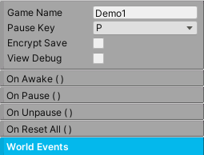

World Manager
+++++++++++++

The **World Manager** is in charge of running the game scripts in order. It's also in charge of  
saving, pausing, resetting the game, and world events.

Each scene must contain exactly **one** World Manager for proper game function. Simply create a gameobject,
add this component, and make sure it's always enabled. This gameobject should never be destroyed.

|

.. list-table::
   :widths: 25 100
   :header-rows: 1

   * - Property
     - 

   * - Game Name
     - The name of the game. Required for saving game data.

   * - Encrypt Save
     - If enabled, this will encrypt the saved data.

   * - Pause Input
     - A convenient button to toggle the pause state of the game.

   * - View Debug
     - If enabled, this will show raycasts from projectiles and other game systems.

   * - On Awake
     - A general purpose Unity Event called during Awake. This can be useful for initializing objects.

   * - On Pause
     - The Unity Event invoked when Pause() is called.

   * - On Unpause
     - The Unity Event invoked when Unpause() is called.

   * - On Reset All
     - The Unity Event invoked when ResetAll() is called.

.. list-table::
   :widths: 25 100
   :header-rows: 1

   * - Method
     - 

   * - Pause()
     - This will pause the game and block player inputs.

   * - Unpause()
     - This will unpause the game.

   * - PauseNoInvoke()
     - This will pause the game and block player inputs without invoking onPause.

   * - UnpauseNoInvoke()
     - This will unpause the game without invoking onUnpause.

   * - ResetAll()
     - This will reset all the relevant scripts in the game like the Player, AI, Interactables, etc.

   * - Save()
     - This will save every Inventory in the scene as well as World Variables, including Health. This is 
       automatically called during OnDisable();

   * - DeleteAllSavedData()
     - This will delete all saved data in the game.

------------

World Events
============

Send messages so world objects can react to important world events. These events are usually created by special events 
in the game, like the player dying. In response, any gameobject that is registered as a listener will be alerted and
react accordingly.

To create a World Event, go to Add World Event, name the event, and click the add button. The World Event is 
actually a scriptable object (**WorldEventSO**) that can be found in the AssetsFolder/Events folder. Create as many as necessary.

Once the World Event has been created, it's going to need a triggering event and event listeners. **WorldEventTrigger** will be 
placed on the object that will trigger the event. To continue the example, when the player dies, its Health component will
call WorldEventTrigger via Unity Event, and that will send an event to all the listeners. **WorldEventListener** is placed on 
any gameobject that needs to react to the event, like a UI element or an enemy AI.

.. list-table::
   :widths: 25 100
   :header-rows: 1

   * - World Event Trigger
     - 

   * - World Event
     - Choose the world event to trigger.

   * - Trigger Event()
     - When this method is called, the specified world event will be triggered.

.. list-table::
   :widths: 25 100
   :header-rows: 1

   * - World Event Listener
     - 

   * - World Event
     - Choose the world event to react to.

   * - On World Event
     - The event that wil be invoked when the world event is triggered.

------------

Save
====

The engine implements JSON Serialization and basic encryption to save game data. Inventory and World Variables rely 
heavily on this. During development, disable Encrypt Save (so you can actually read the data) and check if your data 
persisted by going to Application.persistedDataPath. Typically, the path will look something like this:

**%userprofile%\\AppData\\LocalLow\\companyname\\productname\\TwoBitMachines\\gameName**

The option to delete all saved data is also available during development to quickly reset and test game state.